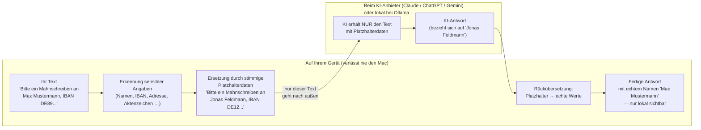

# Tegmaguard

**Lokale Anonymisierung für KI-Nutzung mit sensiblen Daten. Made in Germany.**

-blue)

---

## Datenschutz durch lokale Anonymisierung vor jeder KI-Anfrage

Tegmaguard schaltet sich vor jede Anfrage an ein KI-Modell und sorgt dafür,
dass erkannte echte Namen, Adressen, IBANs, Aktenzeichen und viele weitere
sensible Angaben das eigene Gerät gar nicht erst verlassen. Wer mit einem
lokalen Modell über Ollama arbeitet, bleibt vollständig offline — kein Netz,
kein externer Server, keine Übermittlung.

Das ist besonders relevant für Berufsgeheimnisträger nach § 203 StGB —
konkret die Profile **Anwalt**, **Steuerberater** und **Gesundheit**. Für
andere Branchen wie Banking gelten eigene rechtliche Rahmenbedingungen (z. B.
Bankgeheimnis, KWG) statt § 203 StGB — Details dazu in
[docs/branchen.md](docs/branchen.md). Der Ollama-Zugriff ist hart auf
localhost beschränkt.

Ehrlich benannte Grenze: Erkennung ist bestmöglich, aber nicht garantiert —
ein Wert, der weder erkannt noch bekannt noch vom Nutzer markiert wurde, kann
nicht geschützt werden. Deshalb zeigt Tegmaguard vor jedem Versand eine
Vorschau, die die Nutzerin oder der Nutzer bestätigen muss, statt sich blind
auf die automatische Erkennung zu verlassen.

## Nicht nur Datenschutz — auch der Nachweis dafür

"Wir schützen Ihre Daten" reicht einer Aufsichtsbehörde oder dem eigenen
Datenschutzbeauftragten oft nicht — verlangt wird ein vorzeigbares Dokument.
Tegmaguard stellt zu jedem einzelnen Fall zwei solche Dokumente aus, jederzeit
erneut abrufbar, nicht nur einmalig beim Kauf:

- **DSGVO-Bericht pro Fall** (PDF/DOCX) — welche Datenkategorien erkannt und
  ersetzt wurden, welcher KI-Anbieter beteiligt war, mit oder ohne
  Klartext-Zuordnung.
- **Löschzertifikat nach Art. 17 DSGVO**, ausgestellt bei jeder Fall-Löschung,
  mit Verifikationsscan, der die tatsächliche Löschung bestätigt statt sie nur
  zu behaupten.

Details: [docs/datenschutz-kurz.md](docs/datenschutz-kurz.md#nicht-nur-schutz--auch-der-nachweis-dafür).

## Tegmaguard nutzen

**[tegmaguard.com](https://tegmaguard.com)**

Fragen oder Kontakt: [info@tegmaguard.com](mailto:info@tegmaguard.com)

## Kostenlose Lokal-Edition

Mit einem lokalen Modell über Ollama (Llama, Gemma, Mistral, Qwen, DeepSeek,
Phi) ist Tegmaguard dauerhaft kostenlos nutzbar. Nur die Anbindung an
Cloud-Anbieter (Claude, ChatGPT, Gemini) erfordert nach der 30-Tage-Testphase
eine Lizenz.

## Branchen-Abdeckung

| Branche | Profil | Beispiel-Kategorien (grob) | Berufsgeheimnis-relevant |
|---|---|---|---|
| Alle Branchen / Einstieg | Allgemein (Standard) | Namen, Adressen, Telefonnummern, E-Mail | Nein |
| Alle Branchen / volle Abdeckung | Universal | Alle Kategorien aus allen Profilen kombiniert | Nein |
| Rechtsanwalt / Kanzlei | Anwalt | Aktenzeichen, Mandantennummer | Ja |
| Steuerberatung | Steuerberater | Steuer-ID, DATEV-Belegnummer | Ja |
| Arztpraxis / Gesundheitswesen | Gesundheit | ICD-Diagnosecode, Patientennummer | Ja |
| Banken & Finanzwesen | Banking | IBAN, BIC, Depotnummer, ISIN | Nein (eigene Regime) |

Ausführlichere Tabelle: [docs/branchen.md](docs/branchen.md).

## Was Tegmaguard tut

Tegmaguard erkennt aktuell über 100 Kategorien personenbezogener und
geschäftskritischer Daten in Texten (DE, AT, CH, FR, ES, GB, IE, US) —
laufend erweitert — und ersetzt sie durch stimmige, aber frei erfundene
Platzhalterdaten (Spiegeldaten), bevor der Text ein KI-Modell erreicht. Nach
der Antwort werden die echten Werte lokal wieder eingesetzt.

## Wie die Spiegeldaten-Methode funktioniert

Bevor ein Text ein KI-Modell erreicht, werden darin enthaltene sensible
Angaben durch stimmige, frei erfundene Platzhalterdaten ersetzt. Nur dieser
bereinigte Text verlässt das Gerät. Die KI antwortet, ohne je die echten
Werte gesehen zu haben. Sobald die Antwort zurückkommt, setzt Tegmaguard
lokal die echten Werte wieder ein — sichtbar nur auf dem eigenen Gerät.

Mit Ollama findet auch der Schritt beim KI-Anbieter lokal auf Ihrem Gerät statt.

## Qualität & Sorgfalt

Tegmaguard wird seit rund einem Jahr entwickelt und mit über 2.000
automatisierten Tests abgesichert. Es gibt eine umfassende interne
DSGVO-Dokumentation, die auf Anfrage für Kunden und Auditoren einsehbar ist.

## Wie man Tegmaguard bekommt

30 Tage kostenlos testen, alle Funktionen inklusive. Danach bleibt Tegmaguard
mit lokaler KI über Ollama dauerhaft kostenlos nutzbar — nur die
Cloud-Anbindung braucht danach eine Lizenz.

**[tegmaguard.com](https://tegmaguard.com)**

## Rechtliches

Impressum: [tegmaguard.com/impressum.html](https://tegmaguard.com/impressum.html)

## Lizenz dieses Repos

Die Inhalte dieses Repositories (Dokumentation, Diagramme, Texte) stehen
unter [CC BY 4.0](LICENSE). Das Produkt Tegmaguard selbst bleibt weiterhin
proprietäre, closed-source Software — diese Lizenz betrifft ausschließlich
die hier veröffentlichte Dokumentation, nicht die Anonymisierungs-Engine.
